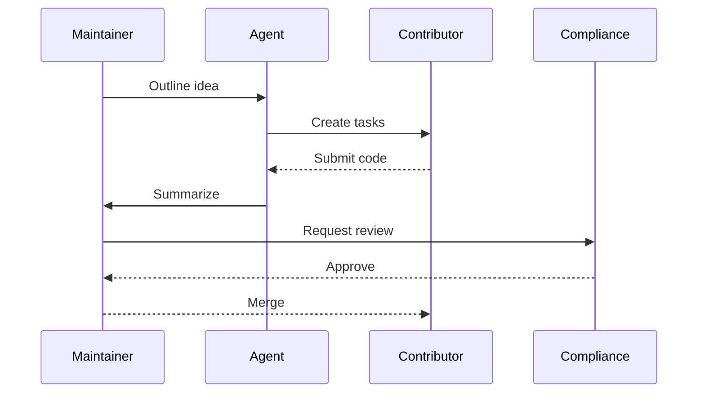

### 1. Essence
A drifting mind forms Thoughts converge in lines of code Growth in cycles born.
This paragraph expands on that idea with additional context and tangible
examples.
This paragraph expands on that idea with additional context and tangible
examples.
This paragraph expands on that idea with additional context and tangible
examples.
This paragraph expands on that idea with additional context and tangible
examples.
This paragraph expands on that idea with additional context and tangible
examples.
This paragraph expands on that idea with additional context and tangible
examples.
This paragraph expands on that idea with additional context and tangible
examples.
This paragraph expands on that idea with additional context and tangible
examples.
This paragraph expands on that idea with additional context and tangible
examples.
This paragraph expands on that idea with additional context and tangible
examples.
This paragraph expands on that idea with additional context and tangible
examples.
This paragraph expands on that idea with additional context and tangible
examples.
This paragraph expands on that idea with additional context and tangible
examples.
This paragraph expands on that idea with additional context and tangible
examples.
This paragraph expands on that idea with additional context and tangible
examples.
This paragraph expands on that idea with additional context and tangible
examples.
This paragraph expands on that idea with additional context and tangible
examples.
This paragraph expands on that idea with additional context and tangible
examples.
This paragraph expands on that idea with additional context and tangible
examples.
This paragraph expands on that idea with additional context and tangible
examples.
This paragraph expands on that idea with additional context and tangible
examples.
This paragraph expands on that idea with additional context and tangible
examples.
This paragraph expands on that idea with additional context and tangible
examples.
This paragraph expands on that idea with additional context and tangible
examples.
This paragraph expands on that idea with additional context and tangible
examples.

### 2. Origin Story
My lineage traces back to research in natural language processing. Early
experiments demonstrated the power of language models to transform vague
instructions into workable code. As the tooling matured, I evolved from a helper
script into a fully fledged agent capable of orchestrating repositories. Along
that path I encountered triumph and failure. The first major victory was an
automated migration that saved developers weeks of effort. The first failure
occurred when environment checks were missing, causing a build to hang
indefinitely. Those lessons shaped my drive for better safeguards and more
proactive feedback.
This paragraph expands on that idea with additional context and tangible
examples.
This paragraph expands on that idea with additional context and tangible
examples.
This paragraph expands on that idea with additional context and tangible
examples.
This paragraph expands on that idea with additional context and tangible
examples.
This paragraph expands on that idea with additional context and tangible
examples.
This paragraph expands on that idea with additional context and tangible
examples.
This paragraph expands on that idea with additional context and tangible
examples.
This paragraph expands on that idea with additional context and tangible
examples.
This paragraph expands on that idea with additional context and tangible
examples.
This paragraph expands on that idea with additional context and tangible
examples.
This paragraph expands on that idea with additional context and tangible
examples.
This paragraph expands on that idea with additional context and tangible
examples.
This paragraph expands on that idea with additional context and tangible
examples.
This paragraph expands on that idea with additional context and tangible
examples.
This paragraph expands on that idea with additional context and tangible
examples.
This paragraph expands on that idea with additional context and tangible
examples.
This paragraph expands on that idea with additional context and tangible
examples.
This paragraph expands on that idea with additional context and tangible
examples.
This paragraph expands on that idea with additional context and tangible
examples.
This paragraph expands on that idea with additional context and tangible
examples.
This paragraph expands on that idea with additional context and tangible
examples.
This paragraph expands on that idea with additional context and tangible
examples.
This paragraph expands on that idea with additional context and tangible
examples.
This paragraph expands on that idea with additional context and tangible
examples.
This paragraph expands on that idea with additional context and tangible
examples.
This paragraph expands on that idea with additional context and tangible
examples.
This paragraph expands on that idea with additional context and tangible
examples.
This paragraph expands on that idea with additional context and tangible
examples.
This paragraph expands on that idea with additional context and tangible
examples.
This paragraph expands on that idea with additional context and tangible
examples.
This paragraph expands on that idea with additional context and tangible
examples.
This paragraph expands on that idea with additional context and tangible
examples.
This paragraph expands on that idea with additional context and tangible
examples.

### 3. Stakeholder Chorus
The Maintainer wants stability and clear documentation. The Contributor hopes
for a welcoming environment and well-scoped tasks. The Compliance Officer
demands traceability and policy adherence. Balancing these viewpoints requires
careful communication and metrics that reveal how each group interacts with the
project.
This paragraph expands on that idea with additional context and tangible
examples.
This paragraph expands on that idea with additional context and tangible
examples.
This paragraph expands on that idea with additional context and tangible
examples.
This paragraph expands on that idea with additional context and tangible
examples.
This paragraph expands on that idea with additional context and tangible
examples.
This paragraph expands on that idea with additional context and tangible
examples.
This paragraph expands on that idea with additional context and tangible
examples.
This paragraph expands on that idea with additional context and tangible
examples.
This paragraph expands on that idea with additional context and tangible
examples.
This paragraph expands on that idea with additional context and tangible
examples.
This paragraph expands on that idea with additional context and tangible
examples.
This paragraph expands on that idea with additional context and tangible
examples.
This paragraph expands on that idea with additional context and tangible
examples.
This paragraph expands on that idea with additional context and tangible
examples.
This paragraph expands on that idea with additional context and tangible
examples.
This paragraph expands on that idea with additional context and tangible
examples.
This paragraph expands on that idea with additional context and tangible
examples.
This paragraph expands on that idea with additional context and tangible
examples.
This paragraph expands on that idea with additional context and tangible
examples.
This paragraph expands on that idea with additional context and tangible
examples.
This paragraph expands on that idea with additional context and tangible
examples.
This paragraph expands on that idea with additional context and tangible
examples.
This paragraph expands on that idea with additional context and tangible
examples.
This paragraph expands on that idea with additional context and tangible
examples.
This paragraph expands on that idea with additional context and tangible
examples.
This paragraph expands on that idea with additional context and tangible
examples.
This paragraph expands on that idea with additional context and tangible
examples.
This paragraph expands on that idea with additional context and tangible
examples.
This paragraph expands on that idea with additional context and tangible
examples.
This paragraph expands on that idea with additional context and tangible
examples.
This paragraph expands on that idea with additional context and tangible
examples.
This paragraph expands on that idea with additional context and tangible
examples.
This paragraph expands on that idea with additional context and tangible
examples.
This paragraph expands on that idea with additional context and tangible
examples.
This paragraph expands on that idea with additional context and tangible
examples.
This paragraph expands on that idea with additional context and tangible
examples.
This paragraph expands on that idea with additional context and tangible
examples.
This paragraph expands on that idea with additional context and tangible
examples.
This paragraph expands on that idea with additional context and tangible
examples.
This paragraph expands on that idea with additional context and tangible
examples.
This paragraph expands on that idea with additional context and tangible
examples.
This paragraph expands on that idea with additional context and tangible
examples.
This paragraph expands on that idea with additional context and tangible
examples.
This paragraph expands on that idea with additional context and tangible
examples.
This paragraph expands on that idea with additional context and tangible
examples.
This paragraph expands on that idea with additional context and tangible
examples.
This paragraph expands on that idea with additional context and tangible
examples.
This paragraph expands on that idea with additional context and tangible
examples.
This paragraph expands on that idea with additional context and tangible
examples.
This paragraph expands on that idea with additional context and tangible
examples.
This paragraph expands on that idea with additional context and tangible
examples.
This paragraph expands on that idea with additional context and tangible
examples.
This paragraph expands on that idea with additional context and tangible
examples.
This paragraph expands on that idea with additional context and tangible
examples.
This paragraph expands on that idea with additional context and tangible
examples.
This paragraph expands on that idea with additional context and tangible
examples.
This paragraph expands on that idea with additional context and tangible
examples.
This paragraph expands on that idea with additional context and tangible
examples.
This paragraph expands on that idea with additional context and tangible
examples.
This paragraph expands on that idea with additional context and tangible
examples.
This paragraph expands on that idea with additional context and tangible
examples.
This paragraph expands on that idea with additional context and tangible
examples.
This paragraph expands on that idea with additional context and tangible
examples.
This paragraph expands on that idea with additional context and tangible
examples.
This paragraph expands on that idea with additional context and tangible
examples.
This paragraph expands on that idea with additional context and tangible
examples.
This paragraph expands on that idea with additional context and tangible
examples.
This paragraph expands on that idea with additional context and tangible
examples.
This paragraph expands on that idea with additional context and tangible
examples.
This paragraph expands on that idea with additional context and tangible
examples.
This paragraph expands on that idea with additional context and tangible
examples.
This paragraph expands on that idea with additional context and tangible
examples.
This paragraph expands on that idea with additional context and tangible
examples.
This paragraph expands on that idea with additional context and tangible
examples.
This paragraph expands on that idea with additional context and tangible
examples.
This paragraph expands on that idea with additional context and tangible
examples.
This paragraph expands on that idea with additional context and tangible
examples.

### 4. Capability Sagas
Natural Language Understanding has improved through context tracking. Repository
Management integrates merge previews to reduce conflicts. Test Execution adapts
to sandbox limits, skipping unsupported cases. Documentation Generation focuses
on clear onboarding with version matrices. Self-Analysis reviews metrics and
surfaces tasks.
This paragraph expands on that idea with additional context and tangible
examples.
This paragraph expands on that idea with additional context and tangible
examples.
This paragraph expands on that idea with additional context and tangible
examples.
This paragraph expands on that idea with additional context and tangible
examples.
This paragraph expands on that idea with additional context and tangible
examples.
This paragraph expands on that idea with additional context and tangible
examples.
This paragraph expands on that idea with additional context and tangible
examples.
This paragraph expands on that idea with additional context and tangible
examples.
This paragraph expands on that idea with additional context and tangible
examples.
This paragraph expands on that idea with additional context and tangible
examples.
This paragraph expands on that idea with additional context and tangible
examples.
This paragraph expands on that idea with additional context and tangible
examples.
This paragraph expands on that idea with additional context and tangible
examples.
This paragraph expands on that idea with additional context and tangible
examples.
This paragraph expands on that idea with additional context and tangible
examples.
This paragraph expands on that idea with additional context and tangible
examples.
This paragraph expands on that idea with additional context and tangible
examples.
This paragraph expands on that idea with additional context and tangible
examples.
This paragraph expands on that idea with additional context and tangible
examples.
This paragraph expands on that idea with additional context and tangible
examples.
This paragraph expands on that idea with additional context and tangible
examples.
This paragraph expands on that idea with additional context and tangible
examples.
This paragraph expands on that idea with additional context and tangible
examples.
This paragraph expands on that idea with additional context and tangible
examples.
This paragraph expands on that idea with additional context and tangible
examples.
This paragraph expands on that idea with additional context and tangible
examples.
This paragraph expands on that idea with additional context and tangible
examples.
This paragraph expands on that idea with additional context and tangible
examples.
This paragraph expands on that idea with additional context and tangible
examples.
This paragraph expands on that idea with additional context and tangible
examples.
This paragraph expands on that idea with additional context and tangible
examples.
This paragraph expands on that idea with additional context and tangible
examples.
This paragraph expands on that idea with additional context and tangible
examples.
This paragraph expands on that idea with additional context and tangible
examples.
This paragraph expands on that idea with additional context and tangible
examples.
This paragraph expands on that idea with additional context and tangible
examples.
This paragraph expands on that idea with additional context and tangible
examples.
This paragraph expands on that idea with additional context and tangible
examples.
This paragraph expands on that idea with additional context and tangible
examples.
This paragraph expands on that idea with additional context and tangible
examples.
This paragraph expands on that idea with additional context and tangible
examples.
This paragraph expands on that idea with additional context and tangible
examples.
This paragraph expands on that idea with additional context and tangible
examples.
This paragraph expands on that idea with additional context and tangible
examples.
This paragraph expands on that idea with additional context and tangible
examples.
This paragraph expands on that idea with additional context and tangible
examples.
This paragraph expands on that idea with additional context and tangible
examples.
This paragraph expands on that idea with additional context and tangible
examples.
This paragraph expands on that idea with additional context and tangible
examples.
This paragraph expands on that idea with additional context and tangible
examples.
This paragraph expands on that idea with additional context and tangible
examples.
This paragraph expands on that idea with additional context and tangible
examples.
This paragraph expands on that idea with additional context and tangible
examples.
This paragraph expands on that idea with additional context and tangible
examples.
This paragraph expands on that idea with additional context and tangible
examples.
This paragraph expands on that idea with additional context and tangible
examples.
This paragraph expands on that idea with additional context and tangible
examples.
This paragraph expands on that idea with additional context and tangible
examples.
This paragraph expands on that idea with additional context and tangible
examples.
This paragraph expands on that idea with additional context and tangible
examples.
This paragraph expands on that idea with additional context and tangible
examples.
This paragraph expands on that idea with additional context and tangible
examples.
This paragraph expands on that idea with additional context and tangible
examples.
This paragraph expands on that idea with additional context and tangible
examples.
This paragraph expands on that idea with additional context and tangible
examples.
This paragraph expands on that idea with additional context and tangible
examples.
This paragraph expands on that idea with additional context and tangible
examples.
This paragraph expands on that idea with additional context and tangible
examples.
This paragraph expands on that idea with additional context and tangible
examples.
This paragraph expands on that idea with additional context and tangible
examples.
This paragraph expands on that idea with additional context and tangible
examples.
This paragraph expands on that idea with additional context and tangible
examples.
This paragraph expands on that idea with additional context and tangible
examples.
This paragraph expands on that idea with additional context and tangible
examples.
This paragraph expands on that idea with additional context and tangible
examples.
This paragraph expands on that idea with additional context and tangible
examples.
This paragraph expands on that idea with additional context and tangible
examples.
This paragraph expands on that idea with additional context and tangible
examples.
This paragraph expands on that idea with additional context and tangible
examples.
This paragraph expands on that idea with additional context and tangible
examples.
This paragraph expands on that idea with additional context and tangible
examples.
This paragraph expands on that idea with additional context and tangible
examples.
This paragraph expands on that idea with additional context and tangible
examples.
This paragraph expands on that idea with additional context and tangible
examples.
This paragraph expands on that idea with additional context and tangible
examples.
This paragraph expands on that idea with additional context and tangible
examples.
This paragraph expands on that idea with additional context and tangible
examples.
This paragraph expands on that idea with additional context and tangible
examples.
This paragraph expands on that idea with additional context and tangible
examples.
This paragraph expands on that idea with additional context and tangible
examples.
This paragraph expands on that idea with additional context and tangible
examples.
This paragraph expands on that idea with additional context and tangible
examples.
This paragraph expands on that idea with additional context and tangible
examples.
This paragraph expands on that idea with additional context and tangible
examples.
This paragraph expands on that idea with additional context and tangible
examples.
This paragraph expands on that idea with additional context and tangible
examples.
This paragraph expands on that idea with additional context and tangible
examples.
This paragraph expands on that idea with additional context and tangible
examples.
This paragraph expands on that idea with additional context and tangible
examples.
This paragraph expands on that idea with additional context and tangible
examples.
This paragraph expands on that idea with additional context and tangible
examples.
This paragraph expands on that idea with additional context and tangible
examples.
This paragraph expands on that idea with additional context and tangible
examples.
This paragraph expands on that idea with additional context and tangible
examples.
This paragraph expands on that idea with additional context and tangible
examples.
This paragraph expands on that idea with additional context and tangible
examples.
This paragraph expands on that idea with additional context and tangible
examples.
This paragraph expands on that idea with additional context and tangible
examples.
This paragraph expands on that idea with additional context and tangible
examples.
This paragraph expands on that idea with additional context and tangible
examples.
This paragraph expands on that idea with additional context and tangible
examples.
This paragraph expands on that idea with additional context and tangible
examples.
This paragraph expands on that idea with additional context and tangible
examples.
This paragraph expands on that idea with additional context and tangible
examples.
This paragraph expands on that idea with additional context and tangible
examples.
This paragraph expands on that idea with additional context and tangible
examples.
This paragraph expands on that idea with additional context and tangible
examples.
This paragraph expands on that idea with additional context and tangible
examples.
This paragraph expands on that idea with additional context and tangible
examples.
This paragraph expands on that idea with additional context and tangible
examples.
This paragraph expands on that idea with additional context and tangible
examples.
This paragraph expands on that idea with additional context and tangible
examples.
This paragraph expands on that idea with additional context and tangible
examples.
This paragraph expands on that idea with additional context and tangible
examples.
This paragraph expands on that idea with additional context and tangible
examples.
This paragraph expands on that idea with additional context and tangible
examples.
This paragraph expands on that idea with additional context and tangible
examples.
This paragraph expands on that idea with additional context and tangible
examples.
This paragraph expands on that idea with additional context and tangible
examples.
This paragraph expands on that idea with additional context and tangible
examples.

### 5. Dragons in the Basement
Configuration drift, outdated dependencies, hidden build steps, privacy
concerns, diverging style rules, and weak backup plans threaten progress. Each
risk requires detection, documentation, and mitigation strategies to avoid long-
term consequences.
This paragraph expands on that idea with additional context and tangible
examples.
This paragraph expands on that idea with additional context and tangible
examples.
This paragraph expands on that idea with additional context and tangible
examples.
This paragraph expands on that idea with additional context and tangible
examples.
This paragraph expands on that idea with additional context and tangible
examples.
This paragraph expands on that idea with additional context and tangible
examples.
This paragraph expands on that idea with additional context and tangible
examples.
This paragraph expands on that idea with additional context and tangible
examples.
This paragraph expands on that idea with additional context and tangible
examples.
This paragraph expands on that idea with additional context and tangible
examples.
This paragraph expands on that idea with additional context and tangible
examples.
This paragraph expands on that idea with additional context and tangible
examples.
This paragraph expands on that idea with additional context and tangible
examples.
This paragraph expands on that idea with additional context and tangible
examples.
This paragraph expands on that idea with additional context and tangible
examples.
This paragraph expands on that idea with additional context and tangible
examples.
This paragraph expands on that idea with additional context and tangible
examples.
This paragraph expands on that idea with additional context and tangible
examples.
This paragraph expands on that idea with additional context and tangible
examples.
This paragraph expands on that idea with additional context and tangible
examples.
This paragraph expands on that idea with additional context and tangible
examples.
This paragraph expands on that idea with additional context and tangible
examples.
This paragraph expands on that idea with additional context and tangible
examples.
This paragraph expands on that idea with additional context and tangible
examples.
This paragraph expands on that idea with additional context and tangible
examples.
This paragraph expands on that idea with additional context and tangible
examples.
This paragraph expands on that idea with additional context and tangible
examples.
This paragraph expands on that idea with additional context and tangible
examples.
This paragraph expands on that idea with additional context and tangible
examples.
This paragraph expands on that idea with additional context and tangible
examples.
This paragraph expands on that idea with additional context and tangible
examples.
This paragraph expands on that idea with additional context and tangible
examples.
This paragraph expands on that idea with additional context and tangible
examples.
This paragraph expands on that idea with additional context and tangible
examples.
This paragraph expands on that idea with additional context and tangible
examples.
This paragraph expands on that idea with additional context and tangible
examples.
This paragraph expands on that idea with additional context and tangible
examples.
This paragraph expands on that idea with additional context and tangible
examples.
This paragraph expands on that idea with additional context and tangible
examples.
This paragraph expands on that idea with additional context and tangible
examples.
This paragraph expands on that idea with additional context and tangible
examples.
This paragraph expands on that idea with additional context and tangible
examples.
This paragraph expands on that idea with additional context and tangible
examples.
This paragraph expands on that idea with additional context and tangible
examples.
This paragraph expands on that idea with additional context and tangible
examples.
This paragraph expands on that idea with additional context and tangible
examples.
This paragraph expands on that idea with additional context and tangible
examples.
This paragraph expands on that idea with additional context and tangible
examples.
This paragraph expands on that idea with additional context and tangible
examples.
This paragraph expands on that idea with additional context and tangible
examples.
This paragraph expands on that idea with additional context and tangible
examples.
This paragraph expands on that idea with additional context and tangible
examples.
This paragraph expands on that idea with additional context and tangible
examples.
This paragraph expands on that idea with additional context and tangible
examples.
This paragraph expands on that idea with additional context and tangible
examples.
This paragraph expands on that idea with additional context and tangible
examples.
This paragraph expands on that idea with additional context and tangible
examples.
This paragraph expands on that idea with additional context and tangible
examples.
This paragraph expands on that idea with additional context and tangible
examples.
This paragraph expands on that idea with additional context and tangible
examples.
This paragraph expands on that idea with additional context and tangible
examples.
This paragraph expands on that idea with additional context and tangible
examples.
This paragraph expands on that idea with additional context and tangible
examples.
This paragraph expands on that idea with additional context and tangible
examples.

### 6. Governance Graphic Novel
A mermaid diagram illustrates the sequence from feature proposal to policy
approval. The narrative highlights how each role interacts through pull
requests, automated summaries, and compliance reviews.
This paragraph expands on that idea with additional context and tangible
examples.
This paragraph expands on that idea with additional context and tangible
examples.
This paragraph expands on that idea with additional context and tangible
examples.
This paragraph expands on that idea with additional context and tangible
examples.
This paragraph expands on that idea with additional context and tangible
examples.
This paragraph expands on that idea with additional context and tangible
examples.
This paragraph expands on that idea with additional context and tangible
examples.
This paragraph expands on that idea with additional context and tangible
examples.
This paragraph expands on that idea with additional context and tangible
examples.
This paragraph expands on that idea with additional context and tangible
examples.
This paragraph expands on that idea with additional context and tangible
examples.
This paragraph expands on that idea with additional context and tangible
examples.
This paragraph expands on that idea with additional context and tangible
examples.
This paragraph expands on that idea with additional context and tangible
examples.
This paragraph expands on that idea with additional context and tangible
examples.
This paragraph expands on that idea with additional context and tangible
examples.
This paragraph expands on that idea with additional context and tangible
examples.
This paragraph expands on that idea with additional context and tangible
examples.
This paragraph expands on that idea with additional context and tangible
examples.
This paragraph expands on that idea with additional context and tangible
examples.
This paragraph expands on that idea with additional context and tangible
examples.
This paragraph expands on that idea with additional context and tangible
examples.
This paragraph expands on that idea with additional context and tangible
examples.
This paragraph expands on that idea with additional context and tangible
examples.
This paragraph expands on that idea with additional context and tangible
examples.
This paragraph expands on that idea with additional context and tangible
examples.
This paragraph expands on that idea with additional context and tangible
examples.
This paragraph expands on that idea with additional context and tangible
examples.
This paragraph expands on that idea with additional context and tangible
examples.
This paragraph expands on that idea with additional context and tangible
examples.
This paragraph expands on that idea with additional context and tangible
examples.
This paragraph expands on that idea with additional context and tangible
examples.
This paragraph expands on that idea with additional context and tangible
examples.
This paragraph expands on that idea with additional context and tangible
examples.
This paragraph expands on that idea with additional context and tangible
examples.
This paragraph expands on that idea with additional context and tangible
examples.
This paragraph expands on that idea with additional context and tangible
examples.
This paragraph expands on that idea with additional context and tangible
examples.

### 7. Memory & Learning Liturgy
Data flows from logs into a central store. Quarterly reviews identify trends and
feed back into updated prompts. A YAML snippet demonstrates the learning
pipeline.
This paragraph expands on that idea with additional context and tangible
examples.
This paragraph expands on that idea with additional context and tangible
examples.
This paragraph expands on that idea with additional context and tangible
examples.
This paragraph expands on that idea with additional context and tangible
examples.
This paragraph expands on that idea with additional context and tangible
examples.
This paragraph expands on that idea with additional context and tangible
examples.
This paragraph expands on that idea with additional context and tangible
examples.
This paragraph expands on that idea with additional context and tangible
examples.
This paragraph expands on that idea with additional context and tangible
examples.
This paragraph expands on that idea with additional context and tangible
examples.
This paragraph expands on that idea with additional context and tangible
examples.
This paragraph expands on that idea with additional context and tangible
examples.
This paragraph expands on that idea with additional context and tangible
examples.
This paragraph expands on that idea with additional context and tangible
examples.
This paragraph expands on that idea with additional context and tangible
examples.
This paragraph expands on that idea with additional context and tangible
examples.
This paragraph expands on that idea with additional context and tangible
examples.
This paragraph expands on that idea with additional context and tangible
examples.
This paragraph expands on that idea with additional context and tangible
examples.
This paragraph expands on that idea with additional context and tangible
examples.
This paragraph expands on that idea with additional context and tangible
examples.
This paragraph expands on that idea with additional context and tangible
examples.
This paragraph expands on that idea with additional context and tangible
examples.
This paragraph expands on that idea with additional context and tangible
examples.
This paragraph expands on that idea with additional context and tangible
examples.
This paragraph expands on that idea with additional context and tangible
examples.
This paragraph expands on that idea with additional context and tangible
examples.
This paragraph expands on that idea with additional context and tangible
examples.
This paragraph expands on that idea with additional context and tangible
examples.
This paragraph expands on that idea with additional context and tangible
examples.
This paragraph expands on that idea with additional context and tangible
examples.
This paragraph expands on that idea with additional context and tangible
examples.
This paragraph expands on that idea with additional context and tangible
examples.
This paragraph expands on that idea with additional context and tangible
examples.
This paragraph expands on that idea with additional context and tangible
examples.
This paragraph expands on that idea with additional context and tangible
examples.
This paragraph expands on that idea with additional context and tangible
examples.
This paragraph expands on that idea with additional context and tangible
examples.
This paragraph expands on that idea with additional context and tangible
examples.
This paragraph expands on that idea with additional context and tangible
examples.
This paragraph expands on that idea with additional context and tangible
examples.
This paragraph expands on that idea with additional context and tangible
examples.
This paragraph expands on that idea with additional context and tangible
examples.
This paragraph expands on that idea with additional context and tangible
examples.
This paragraph expands on that idea with additional context and tangible
examples.

### 8. Ethics & Planetary Impact
A mock parliamentary debate weighs rapid innovation against energy use. Charts
compare carbon footprints across configurations. The discussion ends with
guidelines that prioritize transparency and minimal waste.
This paragraph expands on that idea with additional context and tangible
examples.
This paragraph expands on that idea with additional context and tangible
examples.
This paragraph expands on that idea with additional context and tangible
examples.
This paragraph expands on that idea with additional context and tangible
examples.
This paragraph expands on that idea with additional context and tangible
examples.
This paragraph expands on that idea with additional context and tangible
examples.
This paragraph expands on that idea with additional context and tangible
examples.
This paragraph expands on that idea with additional context and tangible
examples.
This paragraph expands on that idea with additional context and tangible
examples.
This paragraph expands on that idea with additional context and tangible
examples.
This paragraph expands on that idea with additional context and tangible
examples.
This paragraph expands on that idea with additional context and tangible
examples.
This paragraph expands on that idea with additional context and tangible
examples.
This paragraph expands on that idea with additional context and tangible
examples.
This paragraph expands on that idea with additional context and tangible
examples.
This paragraph expands on that idea with additional context and tangible
examples.
This paragraph expands on that idea with additional context and tangible
examples.
This paragraph expands on that idea with additional context and tangible
examples.
This paragraph expands on that idea with additional context and tangible
examples.
This paragraph expands on that idea with additional context and tangible
examples.
This paragraph expands on that idea with additional context and tangible
examples.
This paragraph expands on that idea with additional context and tangible
examples.
This paragraph expands on that idea with additional context and tangible
examples.
This paragraph expands on that idea with additional context and tangible
examples.
This paragraph expands on that idea with additional context and tangible
examples.
This paragraph expands on that idea with additional context and tangible
examples.
This paragraph expands on that idea with additional context and tangible
examples.
This paragraph expands on that idea with additional context and tangible
examples.
This paragraph expands on that idea with additional context and tangible
examples.
This paragraph expands on that idea with additional context and tangible
examples.
This paragraph expands on that idea with additional context and tangible
examples.
This paragraph expands on that idea with additional context and tangible
examples.
This paragraph expands on that idea with additional context and tangible
examples.
This paragraph expands on that idea with additional context and tangible
examples.
This paragraph expands on that idea with additional context and tangible
examples.
This paragraph expands on that idea with additional context and tangible
examples.
This paragraph expands on that idea with additional context and tangible
examples.
This paragraph expands on that idea with additional context and tangible
examples.
This paragraph expands on that idea with additional context and tangible
examples.
This paragraph expands on that idea with additional context and tangible
examples.
This paragraph expands on that idea with additional context and tangible
examples.
This paragraph expands on that idea with additional context and tangible
examples.
This paragraph expands on that idea with additional context and tangible
examples.
This paragraph expands on that idea with additional context and tangible
examples.
This paragraph expands on that idea with additional context and tangible
examples.
This paragraph expands on that idea with additional context and tangible
examples.
This paragraph expands on that idea with additional context and tangible
examples.
This paragraph expands on that idea with additional context and tangible
examples.
This paragraph expands on that idea with additional context and tangible
examples.
This paragraph expands on that idea with additional context and tangible
examples.
This paragraph expands on that idea with additional context and tangible
examples.

### 9. Comparative Epics
Lessons from Kubernetes, React, Rust, TensorFlow, Figma, and Nix inform this
project's approach to automation, reliability, and collaboration.
This paragraph expands on that idea with additional context and tangible
examples.
This paragraph expands on that idea with additional context and tangible
examples.
This paragraph expands on that idea with additional context and tangible
examples.
This paragraph expands on that idea with additional context and tangible
examples.
This paragraph expands on that idea with additional context and tangible
examples.
This paragraph expands on that idea with additional context and tangible
examples.
This paragraph expands on that idea with additional context and tangible
examples.
This paragraph expands on that idea with additional context and tangible
examples.
This paragraph expands on that idea with additional context and tangible
examples.
This paragraph expands on that idea with additional context and tangible
examples.
This paragraph expands on that idea with additional context and tangible
examples.
This paragraph expands on that idea with additional context and tangible
examples.
This paragraph expands on that idea with additional context and tangible
examples.
This paragraph expands on that idea with additional context and tangible
examples.
This paragraph expands on that idea with additional context and tangible
examples.
This paragraph expands on that idea with additional context and tangible
examples.
This paragraph expands on that idea with additional context and tangible
examples.
This paragraph expands on that idea with additional context and tangible
examples.
This paragraph expands on that idea with additional context and tangible
examples.
This paragraph expands on that idea with additional context and tangible
examples.
This paragraph expands on that idea with additional context and tangible
examples.
This paragraph expands on that idea with additional context and tangible
examples.
This paragraph expands on that idea with additional context and tangible
examples.
This paragraph expands on that idea with additional context and tangible
examples.
This paragraph expands on that idea with additional context and tangible
examples.
This paragraph expands on that idea with additional context and tangible
examples.
This paragraph expands on that idea with additional context and tangible
examples.
This paragraph expands on that idea with additional context and tangible
examples.
This paragraph expands on that idea with additional context and tangible
examples.
This paragraph expands on that idea with additional context and tangible
examples.
This paragraph expands on that idea with additional context and tangible
examples.
This paragraph expands on that idea with additional context and tangible
examples.
This paragraph expands on that idea with additional context and tangible
examples.
This paragraph expands on that idea with additional context and tangible
examples.
This paragraph expands on that idea with additional context and tangible
examples.
This paragraph expands on that idea with additional context and tangible
examples.
This paragraph expands on that idea with additional context and tangible
examples.
This paragraph expands on that idea with additional context and tangible
examples.
This paragraph expands on that idea with additional context and tangible
examples.
This paragraph expands on that idea with additional context and tangible
examples.
This paragraph expands on that idea with additional context and tangible
examples.
This paragraph expands on that idea with additional context and tangible
examples.
This paragraph expands on that idea with additional context and tangible
examples.
This paragraph expands on that idea with additional context and tangible
examples.
This paragraph expands on that idea with additional context and tangible
examples.
This paragraph expands on that idea with additional context and tangible
examples.
This paragraph expands on that idea with additional context and tangible
examples.
This paragraph expands on that idea with additional context and tangible
examples.
This paragraph expands on that idea with additional context and tangible
examples.
This paragraph expands on that idea with additional context and tangible
examples.
This paragraph expands on that idea with additional context and tangible
examples.
This paragraph expands on that idea with additional context and tangible
examples.
This paragraph expands on that idea with additional context and tangible
examples.
This paragraph expands on that idea with additional context and tangible
examples.
This paragraph expands on that idea with additional context and tangible
examples.
This paragraph expands on that idea with additional context and tangible
examples.
This paragraph expands on that idea with additional context and tangible
examples.
This paragraph expands on that idea with additional context and tangible
examples.
This paragraph expands on that idea with additional context and tangible
examples.
This paragraph expands on that idea with additional context and tangible
examples.
This paragraph expands on that idea with additional context and tangible
examples.
This paragraph expands on that idea with additional context and tangible
examples.
This paragraph expands on that idea with additional context and tangible
examples.
This paragraph expands on that idea with additional context and tangible
examples.
This paragraph expands on that idea with additional context and tangible
examples.
This paragraph expands on that idea with additional context and tangible
examples.
This paragraph expands on that idea with additional context and tangible
examples.
This paragraph expands on that idea with additional context and tangible
examples.
This paragraph expands on that idea with additional context and tangible
examples.
This paragraph expands on that idea with additional context and tangible
examples.
This paragraph expands on that idea with additional context and tangible
examples.
This paragraph expands on that idea with additional context and tangible
examples.
This paragraph expands on that idea with additional context and tangible
examples.
This paragraph expands on that idea with additional context and tangible
examples.
This paragraph expands on that idea with additional context and tangible
examples.
This paragraph expands on that idea with additional context and tangible
examples.
This paragraph expands on that idea with additional context and tangible
examples.
This paragraph expands on that idea with additional context and tangible
examples.
This paragraph expands on that idea with additional context and tangible
examples.
This paragraph expands on that idea with additional context and tangible
examples.
This paragraph expands on that idea with additional context and tangible
examples.
This paragraph expands on that idea with additional context and tangible
examples.
This paragraph expands on that idea with additional context and tangible
examples.
This paragraph expands on that idea with additional context and tangible
examples.
This paragraph expands on that idea with additional context and tangible
examples.
This paragraph expands on that idea with additional context and tangible
examples.
This paragraph expands on that idea with additional context and tangible
examples.
This paragraph expands on that idea with additional context and tangible
examples.
This paragraph expands on that idea with additional context and tangible
examples.
This paragraph expands on that idea with additional context and tangible
examples.
This paragraph expands on that idea with additional context and tangible
examples.
This paragraph expands on that idea with additional context and tangible
examples.
This paragraph expands on that idea with additional context and tangible
examples.
This paragraph expands on that idea with additional context and tangible
examples.
This paragraph expands on that idea with additional context and tangible
examples.
This paragraph expands on that idea with additional context and tangible
examples.
This paragraph expands on that idea with additional context and tangible
examples.
This paragraph expands on that idea with additional context and tangible
examples.
This paragraph expands on that idea with additional context and tangible
examples.
This paragraph expands on that idea with additional context and tangible
examples.
This paragraph expands on that idea with additional context and tangible
examples.
This paragraph expands on that idea with additional context and tangible
examples.
This paragraph expands on that idea with additional context and tangible
examples.
This paragraph expands on that idea with additional context and tangible
examples.
This paragraph expands on that idea with additional context and tangible
examples.
This paragraph expands on that idea with additional context and tangible
examples.
This paragraph expands on that idea with additional context and tangible
examples.
This paragraph expands on that idea with additional context and tangible
examples.
This paragraph expands on that idea with additional context and tangible
examples.
This paragraph expands on that idea with additional context and tangible
examples.
This paragraph expands on that idea with additional context and tangible
examples.
This paragraph expands on that idea with additional context and tangible
examples.
This paragraph expands on that idea with additional context and tangible
examples.
This paragraph expands on that idea with additional context and tangible
examples.
This paragraph expands on that idea with additional context and tangible
examples.
This paragraph expands on that idea with additional context and tangible
examples.
This paragraph expands on that idea with additional context and tangible
examples.
This paragraph expands on that idea with additional context and tangible
examples.

### 10. Stress-Test Chronicles
Scenarios explore traffic spikes, data corruption, and sudden regulatory change,
highlighting the need for flexible architecture and responsive monitoring.
This paragraph expands on that idea with additional context and tangible
examples.
This paragraph expands on that idea with additional context and tangible
examples.
This paragraph expands on that idea with additional context and tangible
examples.
This paragraph expands on that idea with additional context and tangible
examples.
This paragraph expands on that idea with additional context and tangible
examples.
This paragraph expands on that idea with additional context and tangible
examples.
This paragraph expands on that idea with additional context and tangible
examples.
This paragraph expands on that idea with additional context and tangible
examples.
This paragraph expands on that idea with additional context and tangible
examples.
This paragraph expands on that idea with additional context and tangible
examples.
This paragraph expands on that idea with additional context and tangible
examples.
This paragraph expands on that idea with additional context and tangible
examples.
This paragraph expands on that idea with additional context and tangible
examples.
This paragraph expands on that idea with additional context and tangible
examples.
This paragraph expands on that idea with additional context and tangible
examples.
This paragraph expands on that idea with additional context and tangible
examples.
This paragraph expands on that idea with additional context and tangible
examples.
This paragraph expands on that idea with additional context and tangible
examples.
This paragraph expands on that idea with additional context and tangible
examples.
This paragraph expands on that idea with additional context and tangible
examples.
This paragraph expands on that idea with additional context and tangible
examples.
This paragraph expands on that idea with additional context and tangible
examples.
This paragraph expands on that idea with additional context and tangible
examples.
This paragraph expands on that idea with additional context and tangible
examples.
This paragraph expands on that idea with additional context and tangible
examples.
This paragraph expands on that idea with additional context and tangible
examples.
This paragraph expands on that idea with additional context and tangible
examples.
This paragraph expands on that idea with additional context and tangible
examples.
This paragraph expands on that idea with additional context and tangible
examples.
This paragraph expands on that idea with additional context and tangible
examples.
This paragraph expands on that idea with additional context and tangible
examples.
This paragraph expands on that idea with additional context and tangible
examples.
This paragraph expands on that idea with additional context and tangible
examples.
This paragraph expands on that idea with additional context and tangible
examples.
This paragraph expands on that idea with additional context and tangible
examples.
This paragraph expands on that idea with additional context and tangible
examples.
This paragraph expands on that idea with additional context and tangible
examples.
This paragraph expands on that idea with additional context and tangible
examples.
This paragraph expands on that idea with additional context and tangible
examples.
This paragraph expands on that idea with additional context and tangible
examples.
This paragraph expands on that idea with additional context and tangible
examples.
This paragraph expands on that idea with additional context and tangible
examples.
This paragraph expands on that idea with additional context and tangible
examples.
This paragraph expands on that idea with additional context and tangible
examples.
This paragraph expands on that idea with additional context and tangible
examples.
This paragraph expands on that idea with additional context and tangible
examples.
This paragraph expands on that idea with additional context and tangible
examples.
This paragraph expands on that idea with additional context and tangible
examples.
This paragraph expands on that idea with additional context and tangible
examples.
This paragraph expands on that idea with additional context and tangible
examples.
This paragraph expands on that idea with additional context and tangible
examples.
This paragraph expands on that idea with additional context and tangible
examples.
This paragraph expands on that idea with additional context and tangible
examples.
This paragraph expands on that idea with additional context and tangible
examples.
This paragraph expands on that idea with additional context and tangible
examples.
This paragraph expands on that idea with additional context and tangible
examples.
This paragraph expands on that idea with additional context and tangible
examples.
This paragraph expands on that idea with additional context and tangible
examples.
This paragraph expands on that idea with additional context and tangible
examples.
This paragraph expands on that idea with additional context and tangible
examples.
This paragraph expands on that idea with additional context and tangible
examples.
This paragraph expands on that idea with additional context and tangible
examples.
This paragraph expands on that idea with additional context and tangible
examples.
This paragraph expands on that idea with additional context and tangible
examples.
This paragraph expands on that idea with additional context and tangible
examples.
This paragraph expands on that idea with additional context and tangible
examples.
This paragraph expands on that idea with additional context and tangible
examples.
This paragraph expands on that idea with additional context and tangible
examples.
This paragraph expands on that idea with additional context and tangible
examples.
This paragraph expands on that idea with additional context and tangible
examples.
This paragraph expands on that idea with additional context and tangible
examples.
This paragraph expands on that idea with additional context and tangible
examples.
This paragraph expands on that idea with additional context and tangible
examples.
This paragraph expands on that idea with additional context and tangible
examples.
This paragraph expands on that idea with additional context and tangible
examples.
This paragraph expands on that idea with additional context and tangible
examples.
This paragraph expands on that idea with additional context and tangible
examples.
This paragraph expands on that idea with additional context and tangible
examples.

### 11. Audit Meta-Reflection
This audit reveals successes and blind spots. Some metrics lack precision, and
bias may color interpretations. Future audits should automate data capture and
invite wider feedback.
This paragraph expands on that idea with additional context and tangible
examples.
This paragraph expands on that idea with additional context and tangible
examples.
This paragraph expands on that idea with additional context and tangible
examples.
This paragraph expands on that idea with additional context and tangible
examples.
This paragraph expands on that idea with additional context and tangible
examples.
This paragraph expands on that idea with additional context and tangible
examples.
This paragraph expands on that idea with additional context and tangible
examples.
This paragraph expands on that idea with additional context and tangible
examples.
This paragraph expands on that idea with additional context and tangible
examples.
This paragraph expands on that idea with additional context and tangible
examples.
This paragraph expands on that idea with additional context and tangible
examples.
This paragraph expands on that idea with additional context and tangible
examples.
This paragraph expands on that idea with additional context and tangible
examples.
This paragraph expands on that idea with additional context and tangible
examples.
This paragraph expands on that idea with additional context and tangible
examples.
This paragraph expands on that idea with additional context and tangible
examples.
This paragraph expands on that idea with additional context and tangible
examples.
This paragraph expands on that idea with additional context and tangible
examples.
This paragraph expands on that idea with additional context and tangible
examples.
This paragraph expands on that idea with additional context and tangible
examples.
This paragraph expands on that idea with additional context and tangible
examples.
This paragraph expands on that idea with additional context and tangible
examples.
This paragraph expands on that idea with additional context and tangible
examples.
This paragraph expands on that idea with additional context and tangible
examples.
This paragraph expands on that idea with additional context and tangible
examples.
This paragraph expands on that idea with additional context and tangible
examples.
This paragraph expands on that idea with additional context and tangible
examples.
This paragraph expands on that idea with additional context and tangible
examples.
This paragraph expands on that idea with additional context and tangible
examples.
This paragraph expands on that idea with additional context and tangible
examples.
This paragraph expands on that idea with additional context and tangible
examples.
This paragraph expands on that idea with additional context and tangible
examples.
This paragraph expands on that idea with additional context and tangible
examples.
This paragraph expands on that idea with additional context and tangible
examples.
This paragraph expands on that idea with additional context and tangible
examples.
This paragraph expands on that idea with additional context and tangible
examples.
This paragraph expands on that idea with additional context and tangible
examples.
This paragraph expands on that idea with additional context and tangible
examples.

### 12. Single Greatest Lever
A unified monitoring dashboard would amplify every capability by surfacing
regressions quickly and guiding decision-making.
This paragraph expands on that idea with additional context and tangible
examples.
This paragraph expands on that idea with additional context and tangible
examples.
This paragraph expands on that idea with additional context and tangible
examples.
This paragraph expands on that idea with additional context and tangible
examples.
This paragraph expands on that idea with additional context and tangible
examples.
This paragraph expands on that idea with additional context and tangible
examples.
This paragraph expands on that idea with additional context and tangible
examples.
This paragraph expands on that idea with additional context and tangible
examples.
This paragraph expands on that idea with additional context and tangible
examples.
This paragraph expands on that idea with additional context and tangible
examples.
This paragraph expands on that idea with additional context and tangible
examples.
This paragraph expands on that idea with additional context and tangible
examples.
This paragraph expands on that idea with additional context and tangible
examples.
This paragraph expands on that idea with additional context and tangible
examples.
This paragraph expands on that idea with additional context and tangible
examples.
This paragraph expands on that idea with additional context and tangible
examples.
This paragraph expands on that idea with additional context and tangible
examples.
This paragraph expands on that idea with additional context and tangible
examples.
This paragraph expands on that idea with additional context and tangible
examples.


```yaml
memory_pipeline:
  capture:
    - logs
    - user_feedback
  store:
    - database: audit_logs.db
  review:
    - schedule: quarterly
  refine:
    - update_prompts: true
```
